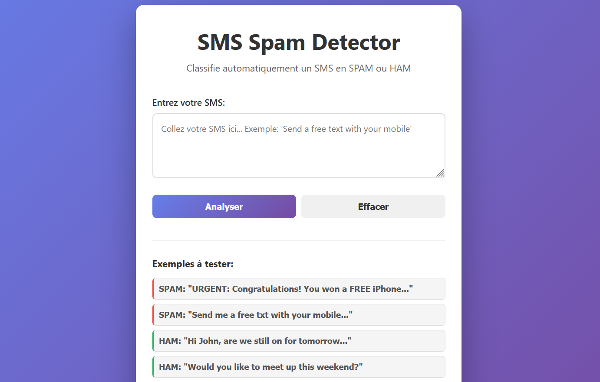

# SMS Spam Detector - Site Web

Un site web interactif pour classifier les SMS en **SPAM** ou **HAM** (pas spam) en utilisant le modèle Naive Bayes entraîné.

## Fonctionnalités

- Interface web élégante et responsive
- Classification en temps réel
- Affichage du niveau de confiance (%)
- Exemples de test prédéfinis
- Design moderne avec gradient

## Installation

### 1. Installer les dépendances

```bash
pip install -r requirements_web.txt
```

### 2. Télécharger le modèle spaCy anglais

```bash
python -m spacy download en_core_web_sm
```

## Démarrage

### Lancer le serveur Flask:

```bash
python app.py
```

Puis ouvre ton navigateur:
```
http://localhost:5000
```

## Premier démarrage

La **première fois** que tu lances `app.py`:
1. Il va télécharger le dataset SMS Spam Collection (~5 MB)
2. Il va entraîner le modèle (~ 2-3 minutes)
3. Il va sauvegarder:
   - `model.pkl` - Modèle Naive Bayes
   - `vectorizer.pkl` - Vectorizer TF-IDF

Les lancements suivants seront **instantanés** (il charge juste les fichiers .pkl)

## Utiliser le site

### Méthode 1: Coller un SMS
1. Copie-colle un SMS dans la zone de texte
2. Clique sur "Analyser"
3. Regarde le résultat (SPAM ou HAM) + confiance

### Méthode 2: Utiliser les exemples
Clique sur un des 4 boutons d'exemples en bas, puis "Analyser"

### Raccourci clavier
- **Ctrl+Entrée** = Soumettre

## Comprendre les résultats

### Exemple 1: SPAM
```
Message: "URGENT: Congratulations! You won a FREE iPhone!"
Résultat: SPAM
Confiance SPAM: 95.2%
Confiance HAM: 4.8%
```

### Exemple 2: HAM
```
Message: "Hi, are we still on for tomorrow?"
Résultat: HAM
Confiance SPAM: 8.3%
Confiance HAM: 91.7%
```

## Architecture

```
.
├── app.py                     # Application Flask (backend)
├── requirements_web.txt       # Dépendances Python
├── templates/
│   └── index.html            # Interface web (HTML/CSS/JS)
├── model.pkl                 # Modèle Naive Bayes (généré)
├── vectorizer.pkl            # Vectorizer TF-IDF (généré)
└── SMSSpamCollection         # Dataset (téléchargé)
```

## API REST

### Endpoint: POST `/predict`

**Request:**
```json
{
  "message": "Your SMS text here"
}
```

**Response (SPAM):**
```json
{
  "success": true,
  "message": "Your SMS text here",
  "label": "SPAM",
  "confidence_spam": 0.952,
  "confidence_ham": 0.048
}
```

**Response (HAM):**
```json
{
  "success": true,
  "message": "Your SMS text here",
  "label": "HAM",
  "confidence_spam": 0.083,
  "confidence_ham": 0.917
}
```

## Preprocessing appliqué

Le même preprocessing que le TP:
1. Supprimer caractères spéciaux (regex: `[^a-zA-Z]`)
2. Convertir en minuscules
3. Tokenization avec spaCy
4. Supprimer stop words
5. Lemmatization
6. Filtrer tokens < 3 caractères

## Personnalisation

### Changer le port (au lieu de 5000):
```python
app.run(debug=True, port=8000)
```

### Changer le max_features du vectorizer:
Édite `app.py`, ligne ~50:
```python
vectorizer = TfidfVectorizer(max_features=3000)  # au lieu de 5000
```

## Troubleshooting

### "ModuleNotFoundError: No module named 'flask'"
```bash
pip install -r requirements_web.txt
```

### "OSError: [E050] Can't find model 'en_core_web_sm'"
```bash
python -m spacy download en_core_web_sm
```

### "FileNotFoundError: SMSSpamCollection"
La première fois, le script télécharge le dataset automatiquement. Si ça échoue:
1. Télécharge manuellement: https://archive.ics.uci.edu/ml/datasets/SMS+Spam+Collection
2. Place le fichier `SMSSpamCollection` dans le dossier courant

## Améliorations possibles

- [ ] Ajouter d'autres algorithmes (SVM, Random Forest)
- [ ] Sauvegarder l'historique des prédictions
- [ ] Ajouter authentification utilisateur
- [ ] Déployer sur Heroku/PythonAnywhere
- [ ] Ajouter graphiques d'accuracy/precision/recall
- [ ] Support multi-langue (français, espagnol, etc.)

## Ressources

- [Dataset SMS Spam Collection](https://archive.ics.uci.edu/ml/datasets/SMS+Spam+Collection)
- [Flask Documentation](https://flask.palletsprojects.com/)
- [scikit-learn Naive Bayes](https://scikit-learn.org/stable/modules/naive_bayes.html)
- [spaCy Documentation](https://spacy.io/)

---

**Créé dans le cadre du TP final - NLP Course (Page 283-287)** 🎓
